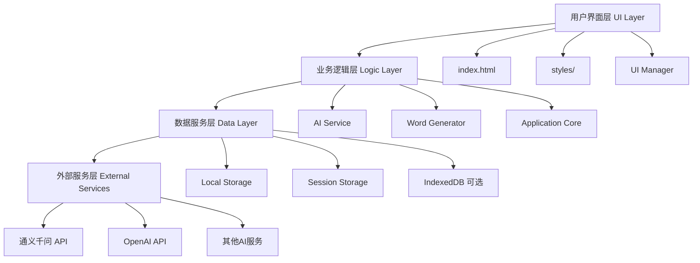
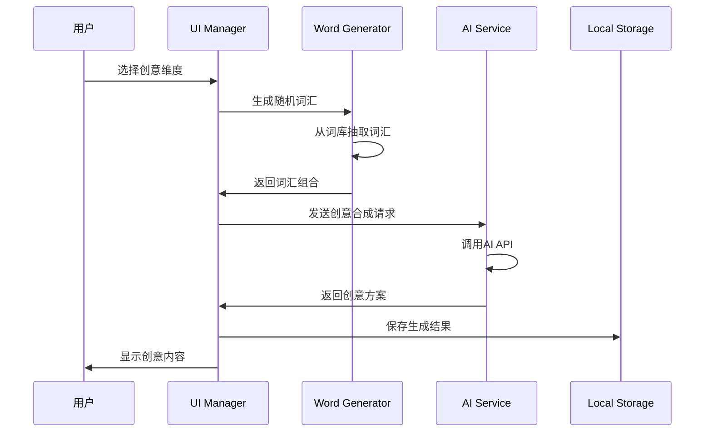

# 🏗️ Indienstein 项目架构设计文档

> 基于Web技术的AI游戏创意生成器 - 系统架构与技术设计

## 📋 概述

Indienstein是一个纯前端Web应用，采用模块化架构设计，通过原生JavaScript实现AI驱动的游戏创意生成功能。项目遵循现代Web开发最佳实践，具备良好的可扩展性和可维护性。

## 🎯 设计目标

- **🔧 模块化**: 清晰的模块划分，低耦合高内聚
- **📱 响应式**: 适配桌面和移动设备
- **⚡ 性能**: 优化加载速度和运行效率
- **🔐 安全**: 保护用户数据和API密钥
- **🔄 可扩展**: 易于添加新功能和AI提供商
- **💾 离线友好**: 核心功能支持离线使用

## 🏗️ 系统架构

### 整体架构图



### 分层架构

#### 1. 用户界面层 (UI Layer)
```
├── index.html              # 主页面结构
├── styles/
│   ├── main.css            # 全局样式和布局
│   └── components.css      # 组件样式
└── UI管理
    ├── 标签页切换
    ├── 模态框管理
    ├── 响应式布局
    └── 动画效果
```

#### 2. 业务逻辑层 (Logic Layer)
```
├── main.js                 # 应用启动和初始化
├── ai-service.js          # AI服务抽象层
├── word-generator.js      # 词汇生成核心逻辑
└── ui-manager.js          # UI交互控制器
```

#### 3. 数据服务层 (Data Layer)
```
├── 本地存储管理
│   ├── 用户设置
│   ├── 聊天历史
│   ├── 词库数据
│   └── 应用状态
└── 数据持久化
    ├── 自动保存
    ├── 数据同步
    └── 导入导出
```

#### 4. 外部服务层 (External Services)
```
├── AI API集成
│   ├── 通义千问
│   ├── OpenAI
│   └── 可扩展接口
└── 网络通信
    ├── HTTP请求
    ├── 流式响应
    └── 错误处理
```

## 🧩 核心模块设计

### 1. Application Core (main.js)

```javascript
class Application {
    constructor() {
        this.config = AppConfig;
        this.services = new Map();
        this.eventBus = new EventBus();
    }
    
    async initialize() {
        // 模块加载
        // 浏览器兼容性检查
        // 服务初始化
        // UI渲染
        // 事件绑定
    }
}
```

**核心职责:**
- 应用生命周期管理
- 模块依赖注入
- 全局事件总线
- 错误处理机制
- 配置管理

### 2. AI Service Module (ai-service.js)

```javascript
class AIService {
    constructor() {
        this.providers = new Map();
        this.currentProvider = null;
        this.assistants = new Map();
    }
    
    // 提供商管理
    registerProvider(name, provider) {}
    switchProvider(name) {}
    
    // 对话管理
    async sendMessage(message, options) {}
    createConversation() {}
    
    // 流式处理
    async streamChat(message, onChunk) {}
}
```

**支持的AI提供商:**
- **通义千问 (Qwen)**: 默认提供商，国内访问友好
- **OpenAI**: 支持GPT-3.5/4系列模型
- **可扩展接口**: 易于添加新的AI服务商

**AI助手角色:**
- **🐱 EggCat**: 猫娘人格，轻松有趣的对话风格
- **💡 创意助手**: 专业游戏设计，深度创意分析
- **🔧 技术顾问**: 技术实现导向，关注可行性

### 3. Word Generator Module (word-generator.js)

```javascript
class WordGenerator {
    constructor() {
        this.dimensions = new Map();
        this.history = [];
        this.filters = {};
    }
    
    // 词库管理
    loadWordbank() {}
    addDimension(name, words) {}
    
    // 生成逻辑
    generateRandomWords(count, dimensions) {}
    combineWords(words, strategy) {}
    
    // 导入导出
    exportWordbank() {}
    importWordbank(data) {}
}
```

**8个创意维度:**
1. **🔧 机制 (Mechanisms)**: 59个核心玩法词汇
2. **🎭 基调 (Tone)**: 47个情感氛围词汇
3. **👥 角色 (Characters)**: 52个角色类型词汇
4. **🏞️ 场景 (Scenes)**: 48个环境设定词汇
5. **🎒 物品 (Items)**: 45个道具装备词汇
6. **🎯 目标 (Goals)**: 38个游戏目标词汇
7. **⚠️ 限制 (Limitations)**: 42个约束条件词汇
8. **✨ 体验 (Experiences)**: 41个体验感受词汇

### 4. UI Manager Module (ui-manager.js)

```javascript
class UIManager {
    constructor() {
        this.components = new Map();
        this.currentTab = 'home';
        this.modals = [];
    }
    
    // 组件管理
    registerComponent(name, component) {}
    renderComponent(name, data) {}
    
    // 页面导航
    switchTab(tabName) {}
    showModal(modal) {}
    
    // 状态管理
    updateUI(state) {}
    bindEvents() {}
}
```

**UI组件树:**
```
App
├── Header
│   ├── Logo
│   └── Navigation
├── TabContainer
│   ├── HomeTab
│   ├── ChatTab
│   │   ├── ChatHistory
│   │   ├── ChatInput
│   │   └── AssistantSelector
│   ├── GeneratorTab
│   │   ├── DimensionSelector
│   │   ├── GenerationControls
│   │   └── ResultDisplay
│   └── SettingsTab
│       ├── AIProviderConfig
│       ├── WordbankManager
│       └── AppPreferences
└── Footer
```

## 📊 数据流设计

### 核心数据流程



### 状态管理

```javascript
// 全局应用状态
const AppState = {
    user: {
        settings: {},
        preferences: {}
    },
    ai: {
        currentProvider: 'qwen',
        currentAssistant: 'eggcat',
        conversations: []
    },
    generator: {
        selectedDimensions: [],
        generationHistory: [],
        currentResults: []
    },
    ui: {
        currentTab: 'home',
        activeModals: [],
        loadingStates: {}
    }
};
```

## 🔧 技术实现细节

### 1. 模块加载机制

```javascript
// 动态模块加载
class ModuleLoader {
    static async loadModule(name) {
        return new Promise((resolve, reject) => {
            const script = document.createElement('script');
            script.src = `scripts/${name}.js`;
            script.onload = () => resolve();
            script.onerror = reject;
            document.head.appendChild(script);
        });
    }
}
```

### 2. 事件系统

```javascript
// 全局事件总线
class EventBus {
    constructor() {
        this.events = new Map();
    }
    
    on(event, callback) {
        if (!this.events.has(event)) {
            this.events.set(event, []);
        }
        this.events.get(event).push(callback);
    }
    
    emit(event, data) {
        if (this.events.has(event)) {
            this.events.get(event).forEach(callback => {
                callback(data);
            });
        }
    }
}
```

### 3. 本地存储策略

```javascript
// 存储管理
class StorageManager {
    static set(key, value) {
        try {
            localStorage.setItem(key, JSON.stringify(value));
        } catch (e) {
            console.warn('Storage quota exceeded');
        }
    }
    
    static get(key, defaultValue = null) {
        try {
            const item = localStorage.getItem(key);
            return item ? JSON.parse(item) : defaultValue;
        } catch (e) {
            return defaultValue;
        }
    }
}
```

### 4. API请求封装

```javascript
// HTTP客户端
class HTTPClient {
    static async request(url, options = {}) {
        const defaultOptions = {
            headers: {
                'Content-Type': 'application/json'
            }
        };
        
        const mergedOptions = { ...defaultOptions, ...options };
        
        try {
            const response = await fetch(url, mergedOptions);
            if (!response.ok) {
                throw new Error(`HTTP ${response.status}: ${response.statusText}`);
            }
            return response;
        } catch (error) {
            console.error('Request failed:', error);
            throw error;
        }
    }
}
```

## 🔐 安全考虑

### 1. API密钥保护
- 密钥仅存储在localStorage中
- 不在URL或日志中暴露
- 支持密钥删除和更换

### 2. 数据验证
- 输入参数验证
- API响应验证
- XSS防护

### 3. 错误处理
- 网络异常处理
- API限流处理
- 优雅降级

## 📈 性能优化

### 1. 加载优化
```javascript
// 懒加载策略
const LazyLoader = {
    async loadComponent(name) {
        if (this.loaded.has(name)) {
            return this.loaded.get(name);
        }
        
        const component = await this.importComponent(name);
        this.loaded.set(name, component);
        return component;
    }
};
```

### 2. 渲染优化
- 虚拟滚动（大量对话历史）
- 防抖输入处理
- 组件缓存

### 3. 内存管理
- 及时清理事件监听器
- 限制历史记录数量
- 图片懒加载

## 🔄 扩展性设计

### 1. 插件系统框架
```javascript
class PluginManager {
    constructor() {
        this.plugins = new Map();
        this.hooks = new Map();
    }
    
    registerPlugin(name, plugin) {
        this.plugins.set(name, plugin);
        plugin.initialize(this.createHookContext());
    }
    
    createHook(name, handler) {
        if (!this.hooks.has(name)) {
            this.hooks.set(name, []);
        }
        this.hooks.get(name).push(handler);
    }
}
```

### 2. AI提供商扩展接口
```javascript
class AIProvider {
    constructor(config) {
        this.config = config;
    }
    
    // 必须实现的接口
    async sendMessage(message, options) {}
    async streamMessage(message, onChunk) {}
    validateConfig() {}
    getModels() {}
}
```

### 3. 词库扩展机制
```javascript
class WordbankExtension {
    constructor(name, data) {
        this.name = name;
        this.dimensions = data.dimensions;
        this.metadata = data.metadata;
    }
    
    install(generator) {
        generator.addExtension(this);
    }
    
    uninstall(generator) {
        generator.removeExtension(this.name);
    }
}
```

## 🚀 部署架构

### 1. 静态托管
- **GitHub Pages**: 免费，自动部署
- **Vercel**: CDN加速，性能优异
- **Netlify**: 功能丰富，支持表单

### 2. CDN策略
```javascript
// 资源CDN配置
const CDNConfig = {
    fonts: 'https://fonts.googleapis.com/',
    icons: 'https://cdn.jsdelivr.net/npm/@tabler/icons@latest/',
    fallback: './assets/'
};
```

### 3. 缓存策略
```javascript
// Service Worker缓存
self.addEventListener('fetch', event => {
    if (event.request.url.includes('/api/')) {
        // API请求不缓存
        return;
    }
    
    event.respondWith(
        caches.match(event.request)
            .then(response => response || fetch(event.request))
    );
});
```

## 📊 监控与分析

### 1. 性能监控
```javascript
// 性能埋点
class PerformanceMonitor {
    static mark(name) {
        performance.mark(name);
    }
    
    static measure(name, start, end) {
        performance.measure(name, start, end);
        const measure = performance.getEntriesByName(name)[0];
        console.log(`${name}: ${measure.duration}ms`);
    }
}
```

### 2. 错误追踪
```javascript
// 全局错误处理
window.addEventListener('error', event => {
    ErrorTracker.log({
        message: event.message,
        filename: event.filename,
        lineno: event.lineno,
        stack: event.error?.stack
    });
});
```

### 3. 用户行为分析
```javascript
// 行为埋点
class Analytics {
    static track(event, properties = {}) {
        const data = {
            event,
            properties,
            timestamp: Date.now(),
            session: this.getSessionId()
        };
        
        this.sendToAnalytics(data);
    }
}
```

## 🔮 未来规划

### 短期目标 (1-3个月)
- [ ] PWA支持，离线使用
- [ ] 更多AI提供商集成
- [ ] 词库编辑器
- [ ] 主题切换功能

### 中期目标 (3-6个月)
- [ ] 用户账户系统
- [ ] 云端数据同步
- [ ] 创意分享社区
- [ ] 移动端APP

### 长期目标 (6个月+)
- [ ] 多语言支持
- [ ] AI模型微调
- [ ] 游戏原型生成
- [ ] 协作功能

---

📝 **文档版本**: v1.0.0  
🕒 **最后更新**: 2024年  
👤 **维护者**: JtheWL (术士木星) 